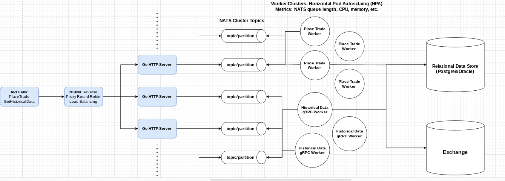

### Systems Architecture



### Project Structure

```
stock_broker/
├── charts/
│   └── stock-broker/
│       ├── Chart.yaml
│       ├── templates/
│       │   ├── deployment-http.yaml
│       │   ├── deployment-worker.yaml
│       │   ├── service-http.yaml
│       │   ├── service-worker.yaml
│       │   ├── hpa-http.yaml
│       │   ├── hpa-worker.yaml
│       │   ├── statefulset-nats.yaml
│       │   ├── ingress.yaml
│       │   └── nginx-configmap.yaml
│       └── values.yaml
├── src/
│   ├── models.go
│   ├── handlers/
│   │   ├── place_trade.go
│   │   ├── historical_data.go
│   ├── services/
│   │   ├── place_trade_service.go
│   │   ├── historical_data_service.go
│   │   └── nats_service.go
│   ├── bin/
│   │   ├── http_server.go
│   │   ├── place_trade_worker.go
│   │   └── historical_data_worker.go
├── proto/
│   ├── historical_data.proto
├── Dockerfile
├── Dockerfile.worker
├── nginx.conf
├── go.mod
├── go.sum
└── .env
```

### `go.mod`

Add the new dependencies to your `go.mod`:

```go
module stock_broker_application

go 1.18

require (
    github.com/nats-io/nats.go v1.12.1
    github.com/gin-gonic/gin v1.8.1
    github.com/joho/godotenv v1.3.0
    google.golang.org/grpc v1.44.0
)
```

### Code Components

### `src/bin/http_server.go`

```go
package main

import (
    "github.com/gin-gonic/gin"
    "github.com/joho/godotenv"
    "github.com/nats-io/nats.go"
    "log"
    "os"
    "stock_broker/handlers"
    "stock_broker/services"
)

func main() {
    err := godotenv.Load()
    if err != nil {
        log.Fatalf("Error loading .env file")
    }

    natsURL := os.Getenv("NATS_URL")
    nc, err := services.ConnectToNATS(natsURL)
    if err != nil {
        log.Fatalf("Failed to connect to NATS: %v", err)
    }

    port := os.Getenv("PORT")
    if port == "" {
        port = "8080"
    }

    router := gin.Default()
    router.POST("/trade", handlers.CreateTradeRequest(nc))
    router.GET("/historical_data", handlers.GetHistoricalData(nc))

    router.Run(":" + port)
}
```

### `src/bin/place_trade_worker.go`

```go
package main

import (
    "github.com/joho/godotenv"
    "log"
    "os"
    "stock_broker/services"
)

func main() {
    err := godotenv.Load()
    if err != nil {
        log.Fatalf("Error loading .env file")
    }

    natsURL := os.Getenv("NATS_URL")
    nc, err := services.ConnectToNATS(natsURL)
    if err != nil {
        log.Fatalf("Failed to connect to NATS: %v", err)
    }

    services.RunPlaceTradeRequestWorker(nc)
}
```

### `src/bin/historical_data_worker.go`

```go
package main

import (
    "github.com/joho/godotenv"
    "log"
    "os"
    "stock_broker/services"
)

func main() {
    err := godotenv.Load()
    if err != nil {
        log.Fatalf("Error loading .env file")
    }

    natsURL := os.Getenv("NATS_URL")
    nc, err := services.ConnectToNATS(natsURL)
    if err != nil {
        log.Fatalf("Failed to connect to NATS: %v", err)
    }

    services.RunHistoricalDataWorker(nc)
}
```

### `src/models.go`

```go
package models

type PlaceTradeRequest struct {
    Symbol   string `json:"symbol"`
    Quantity uint32 `json:"quantity"`
    Action   string `json:"action"`
}

type HistoricalDataRequestMessage struct {
    Symbol        string `json:"symbol"`
    StartTimestamp int64  `json:"start_timestamp"`
    EndTimestamp   int64  `json:"end_timestamp"`
}
```

### `src/handlers/place_trade.go`

```go
package handlers

import (
    "github.com/gin-gonic/gin"
    "github.com/nats-io/nats.go"
    "net/http"
    "stock_broker/models"
    "stock_broker/services"
)

func CreateTradeRequest(nc *nats.Conn) gin.HandlerFunc {
    return func(c *gin.Context) {
        var tradeRequest models.PlaceTradeRequest
        if err := c.ShouldBindJSON(&tradeRequest); err != nil {
            c.JSON(http.StatusBadRequest, gin.H{"error": "Invalid request"})
            return
        }

        message, err := json.Marshal(tradeRequest)
        if err != nil {
            c.JSON(http.StatusInternalServerError, gin.H{"error": "Failed to serialize trade request"})
            return
        }

        err = services.PublishToNATS(nc, "place_trade_request", message)
        if err != nil {
            c.JSON(http.StatusInternalServerError, gin.H{"error": "Failed to publish trade request to NATS"})
            return
        }

        c.JSON(http.StatusOK, gin.H{"status": "success", "message": "Trade request published to NATS"})
    }
}
```

### `src/handlers/historical_data.go`

```go
package handlers

import (
    "github.com/gin-gonic/gin"
    "github.com/nats-io/nats.go"
    "net/http"
    "stock_broker/models"
    "stock_broker/services"
)

func GetHistoricalData(nc *nats.Conn) gin.HandlerFunc {
    return func(c *gin.Context) {
        var query models.HistoricalDataRequestMessage
        if err := c.ShouldBindQuery(&query); err != nil {
            c.JSON(http.StatusBadRequest, gin.H{"error": "Invalid request"})
            return
        }

        message, err := json.Marshal(query)
        if err != nil {
            c.JSON(http.StatusInternalServerError, gin.H{"error": "Failed to serialize historical data request"})
            return
        }

        err = services.PublishToNATS(nc, "historical_data_request", message)
        if err != nil {
            c.JSON(http.StatusInternalServerError, gin.H{"error": "Failed to publish request to NATS"})
            return
        }

        c.JSON(http.StatusOK, gin.H{"status": "success", "message": "Request for historical data published to NATS"})
    }
}
```

### `src/services/place_trade_service.go`

```go
package services

import (
    "encoding/json"
    "fmt"
    "github.com/nats-io/nats.go"
    "log"
    "stock_broker/models"
    "time"
)

func RunPlaceTradeRequestWorker(nc *nats.Conn) {
    sub, err := nc.Subscribe("place_trade_request", func(msg *nats.Msg) {
        var tradeRequest models.PlaceTradeRequest
        if err := json.Unmarshal(msg.Data, &tradeRequest); err != nil {
            log.Printf("Failed to deserialize message: %v", err)
            return
        }

        log.Printf("Received place trade request: %+v", tradeRequest)

        response, err := processTradeRequest(tradeRequest)
        if err != nil {
            log.Printf("Failed to process trade request: %v", err)
        } else {
            log.Printf("Processed trade request: %+v", response)
        }
    })
    if err != nil {
        log.Fatalf("Failed to subscribe to 'place_trade_request': %v", err)
    }

    log.Println("Listening for place trade request messages...")
    sub.AutoUnsubscribe(1)
    select {}
}

func processTradeRequest(tradeRequest models.PlaceTradeRequest) (map[string]interface{}, error) {
    simulatedResponse := map[string]interface{}{
        "symbol":  tradeRequest.Symbol,
        "quantity": tradeRequest.Quantity,
        "action":  tradeRequest.Action,
        "status":  "success",
        "message": "Trade executed successfully",
    }

    time.Sleep(2 * time.Second)

    return simulatedResponse, nil
}
```

### `src/services/historical_data_service.go`

```go
package services

import (
    "context"
    "encoding/json"
    "fmt"
    "github.com/nats-io/nats.go"
    "google.golang.org/grpc"
    "log"
    "stock_broker/models"
    pb "stock_broker/proto"
)

func RunHistoricalDataWorker(nc *nats.Conn) {
    sub, err := nc.Subscribe("historical_data_request", func(msg *nats.Msg) {
        var request models.HistoricalDataRequestMessage
        if err := json.Unmarshal(msg.Data, &request); err != nil {
            log.Printf("Failed to deserialize message: %v", err)
            return
        }

       

 log.Printf("Received historical data request: %+v", request)

        response, err := fetchHistoricalData(request)
        if err != nil {
            log.Printf("Failed to fetch historical data: %v", err)
        } else {
            log.Printf("Fetched historical data: %+v", response)
        }
    })
    if err != nil {
        log.Fatalf("Failed to subscribe to 'historical_data_request': %v", err)
    }

    log.Println("Listening for historical data request messages...")
    sub.AutoUnsubscribe(1)
    select {}
}

func fetchHistoricalData(request models.HistoricalDataRequestMessage) (*pb.HistoricalDataResponse, error) {
    conn, err := grpc.Dial("localhost:50051", grpc.WithInsecure())
    if err != nil {
        log.Fatalf("Failed to connect to gRPC server: %v", err)
    }
    defer conn.Close()

    client := pb.NewHistoricalDataServiceClient(conn)

    grpcRequest := &pb.HistoricalDataRequest{
        Symbol: request.Symbol,
        StartTimestamp: request.StartTimestamp,
        EndTimestamp: request.EndTimestamp,
    }

    response, err := client.GetHistoricalData(context.Background(), grpcRequest)
    if err != nil {
        return nil, fmt.Errorf("error while calling GetHistoricalData RPC: %v", err)
    }

    return response, nil
}
```

### `src/services/nats_service.go`

```go
package services

import (
    "github.com/nats-io/nats.go"
    "log"
)

func ConnectToNATS(url string) (*nats.Conn, error) {
    nc, err := nats.Connect(url)
    if err != nil {
        return nil, err
    }

    return nc, nil
}

func PublishToNATS(nc *nats.Conn, subject string, message []byte) error {
    err := nc.Publish(subject, message)
    if err != nil {
        log.Printf("Failed to publish to NATS: %v", err)
        return err
    }

    return nil
}
```

### `.env`

```
NATS_URL=nats://nats:4222
PORT=8080
```

### `Dockerfile`

```dockerfile
# Dockerfile for HTTP Server

# Use the official Golang image as a base image
FROM golang:1.18 as builder

# Set the Current Working Directory inside the container
WORKDIR /app

# Copy go mod and sum files
COPY go.mod go.sum ./

# Download all dependencies. Dependencies will be cached if the go.mod and go.sum files are not changed
RUN go mod download

# Copy the source from the current directory to the Working Directory inside the container
COPY . .

# Build the Go app
RUN go build -o main src/bin/http_server.go

# Start a new stage from scratch
FROM golang:1.18

WORKDIR /app

# Copy the Pre-built binary file from the previous stage
COPY --from=builder /app/main .

# Expose port 8080 to the outside world
EXPOSE 8080

# Command to run the executable
CMD ["./main"]
```

### `Dockerfile.worker`

```dockerfile
# Dockerfile for Workers

# Use the official Golang image as a base image
FROM golang:1.18 as builder

# Set the Current Working Directory inside the container
WORKDIR /app

# Copy go mod and sum files
COPY go.mod go.sum ./

# Download all dependencies. Dependencies will be cached if the go.mod and go.sum files are not changed
RUN go mod download

# Copy the source from the current directory to the Working Directory inside the container
COPY . .

# Build the Go app
RUN go build -o place_trade_worker src/bin/place_trade_worker.go
RUN go build -o historical_data_worker src/bin/historical_data_worker.go

# Start a new stage from scratch
FROM golang:1.18

WORKDIR /app

# Copy the Pre-built binary files from the previous stage
COPY --from=builder /app/place_trade_worker .
COPY --from=builder /app/historical_data_worker .

# Command to run the Place Trade Worker
CMD ["./place_trade_worker"]

# Command to run the Historical Data Worker
CMD ["./historical_data_worker"]
```

### `nginx.conf`

```nginx
events {}

http {
    upstream backend {
        server http_server:8080;
    }

    server {
        listen 80;

        location / {
            proxy_pass http://backend;
        }
    }
}
```

### Helm Chart Files

- **`charts/stock-broker/Chart.yaml`**

```yaml
apiVersion: v2
name: stock-broker
description: A Helm chart for Kubernetes
type: application
version: 0.1.0
appVersion: "1.0"
```

- **`charts/stock-broker/templates/deployment-http.yaml`**

```yaml
apiVersion: apps/v1
kind: Deployment
metadata:
  name: stock-broker-http
spec:
  replicas: 1
  selector:
    matchLabels:
      app: stock-broker-http
  template:
    metadata:
      labels:
        app: stock-broker-http
    spec:
      containers:
      - name: stock-broker-http
        image: stock_broker:latest
        ports:
        - containerPort: 8080
        envFrom:
        - configMapRef:
            name: stock-broker-config
```

- **`charts/stock-broker/templates/deployment-worker.yaml`**

```yaml
apiVersion: apps/v1
kind: Deployment
metadata:
  name: stock-broker-worker
spec:
  replicas: 1
  selector:
    matchLabels:
      app: stock-broker-worker
  template:
    metadata:
      labels:
        app: stock-broker-worker
    spec:
      containers:
      - name: stock-broker-worker
        image: stock_broker_worker:latest
        envFrom:
        - configMapRef:
            name: stock-broker-config
```

- **`charts/stock-broker/templates/service-http.yaml`**

```yaml
apiVersion: v1
kind: Service
metadata:
  name: stock-broker-http
spec:
  selector:
    app: stock-broker-http
  ports:
    - protocol: TCP
      port: 80
      targetPort: 8080
```

- **`charts/stock-broker/templates/service-worker.yaml`**

```yaml
apiVersion: v1
kind: Service
metadata:
  name: stock-broker-worker
spec:
  selector:
    app: stock-broker-worker
  ports:
    - protocol: TCP
      port: 80
      targetPort: 8080
```

- **`charts/stock-broker/templates/hpa-http.yaml`**

```yaml
apiVersion: autoscaling/v1
kind: HorizontalPodAutoscaler
metadata:
  name: stock-broker-http-hpa
spec:
  scaleTargetRef:
    apiVersion: apps/v1
    kind: Deployment
    name: stock-broker-http
  minReplicas: 1
  maxReplicas: 10
  targetCPUUtilizationPercentage: 50
```

- **`charts/stock-broker/templates/hpa-worker.yaml`**

```yaml
apiVersion: autoscaling/v1
kind: HorizontalPodAutoscaler
metadata:
  name: stock-broker-worker-hpa
spec:
  scaleTargetRef:
    apiVersion: apps/v1
    kind: Deployment
    name: stock-broker-worker
  minReplicas: 1
  maxReplicas: 10
  targetCPUUtilizationPercentage: 50
```

- **`charts/stock-broker/templates/statefulset-nats.yaml`**

```yaml
apiVersion: apps/v1
kind: StatefulSet
metadata:
  name: nats
spec:
  serviceName: "nats"
  replicas: 1
  selector:
    matchLabels:
      app: nats
  template:
    metadata:
      labels:
        app: nats
    spec:
      containers:
      - name: nats
        image: nats:latest
        ports:
        - containerPort: 4222
          name: client
        - containerPort: 6222
          name: cluster
        - containerPort: 8222
          name: http
  volumeClaimTemplates:
  - metadata:
      name: nats-storage
    spec:
      accessModes: [ "ReadWriteOnce" ]
      resources:
        requests:
          storage: 10Gi
```

- **`charts/stock-broker/templates/ingress.yaml`**

```yaml
apiVersion: networking.k8s.io/v1
kind: Ingress
metadata:
  name: stock-broker-ingress
  annotations:
    nginx.ingress.kubernetes.io/rewrite-target: /
spec:
  rules:
  - host: stockbroker.local
    http:
      paths:
      - path: /
        pathType: Prefix
        backend:
          service:
            name: stock-broker-http
            port:
              number: 80
```

- **`charts/stock-broker/templates/nginx-configmap.yaml`**

```yaml
apiVersion: v1
kind: ConfigMap
metadata:
  name: nginx-config
data:
  nginx.conf: |
    events {}
    http {
        upstream backend {
            server stock-broker-http:8080;
        }

        server {
            listen 80;

            location / {
                proxy_pass http://backend;
            }
        }
    }
```

- **`charts/stock-broker/values.yaml`**

```

yaml
replicaCount: 1

image:
  repository: stock_broker
  pullPolicy: IfNotPresent
  tag: latest

imageWorker:
  repository: stock_broker_worker
  pullPolicy: IfNotPresent
  tag: latest

service:
  type: ClusterIP
  port: 80

env:
  - name: NATS_URL
    value: nats://nats:4222
  - name: PORT
    value: "8080"

resources: {}
nodeSelector: {}
tolerations: []
affinity: {}
```


### Summary

This project consists of a stockbroker application written in Go. It includes HTTP and gRPC servers, NATS messaging for communication, and is containerized using Docker. The project is managed and deployed using Kubernetes with Helm charts.

- **HTTP Server**: Handles client requests for trading operations.
- **gRPC Server**: Provides methods for fetching historical data.
- **NATS Messaging**: Used for asynchronous communication between services.
- **Docker**: Containers for HTTP server, workers, and NATS.
- **Kubernetes**: Manages the deployment of these containers, including scaling and networking.
- **Helm**: Simplifies Kubernetes application deployment and management.

The codebase is structured with separate files for models, handlers, and services. The application is scalable and designed to be resilient, utilizing Kubernetes' capabilities for load balancing and auto-scaling. The provided Dockerfiles and Helm charts ensure smooth deployment and management of the application in a cloud-native environment.