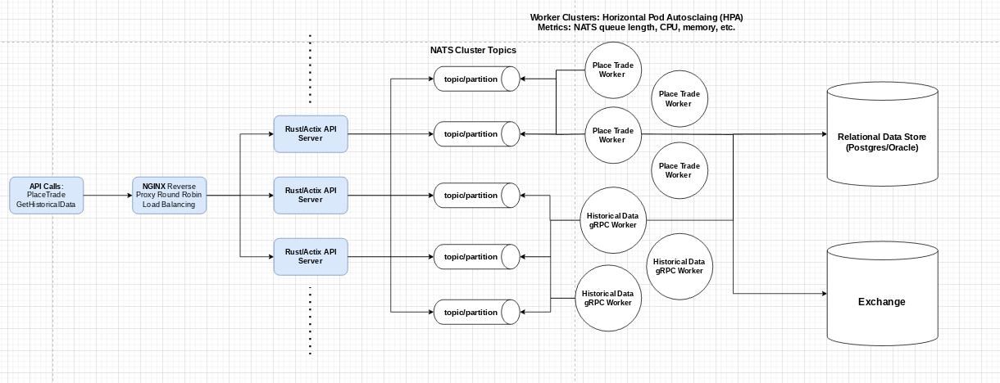

### Systems Architecture




### Project Structure

```
stock_broker/
├── charts/
│   └── stock-broker/
│       ├── Chart.yaml
│       ├── templates/
│       │   ├── deployment-http.yaml
│       │   ├── deployment-worker.yaml
│       │   ├── service-http.yaml
│       │   ├── service-worker.yaml
│       │   ├── hpa-http.yaml
│       │   ├── hpa-worker.yaml
│       │   ├── statefulset-nats.yaml
│       │   ├── ingress.yaml
│       │   └── nginx-configmap.yaml
│       └── values.yaml
├── src/
│   ├── models.rs
│   ├── handlers/
│   │   ├── place_trade.rs
│   │   ├── historical_data.rs
│   ├── services/
│   │   ├── place_trade_service.rs
│   │   ├── historical_data_service.rs
│   │   └── nats_service.rs
│   ├── bin/
│   │   ├── http_server.rs
│   │   ├── place_trade_worker.rs
│   │   └── historical_data_worker.rs
├── Dockerfile
├── Dockerfile.worker
├── nginx.conf
├── Cargo.toml
└── .env
```

### `Cargo.toml`

Add the new binaries to your `Cargo.toml`:

```toml
[package]
name = "stock_broker_application"
version = "0.1.0"
edition = "2021"

[dependencies]
nats = "0.14.0"
actix-web = "4.0.0"
dotenv = "0.15.0"
tokio = { version = "1.0", features = ["full"] }

[[bin]]
name = "http_server"
path = "src/bin/http_server.rs"

[[bin]]
name = "place_trade_worker"
path = "src/bin/place_trade_worker.rs"

[[bin]]
name = "historical_data_worker"
path = "src/bin/historical_data_worker.rs"

```


### Code Components

### `src/bin/http_server.rs`

```rust
use actix_web::{web, App, HttpResponse, HttpServer};
use std::env;
use dotenv::dotenv;
use nats::asynk::Connection;

mod handlers;
mod services;

use handlers::place_trade::create_trade_request;
use handlers::historical_data::get_historical_data;
use services::nats_service::connect_to_nats;

#[actix_web::main]
async fn main() -> std::io::Result<()> {
    dotenv().ok();

    let nats_url = env::var("NATS_URL").expect("NATS_URL must be set");
    let nats = connect_to_nats(&nats_url).await.expect("Failed to connect to NATS");

    let port = env::var("PORT").unwrap_or_else(|_| "8080".to_string());
    let port: u16 = port.parse().expect("PORT must be a number");

    HttpServer::new(move || {
        App::new()
            .data(nats.clone())
            .route("/trade", web::post().to(create_trade_request))
            .route("/historical_data", web::get().to(get_historical_data))
    })
    .bind(("0.0.0.0", port))?
    .run()
    .await
}
```

### `src/bin/place_trade_worker.rs`

```rust
use dotenv::dotenv;
use std::env;
use nats::asynk::Connection;
use crate::services::nats_service::connect_to_nats;
use crate::services::place_trade_service::run_place_trade_request_worker;

#[tokio::main]
async fn main() -> Result<(), Box<dyn std::error::Error>> {
    dotenv().ok();

    let nats_url = env::var("NATS_URL").expect("NATS_URL must be set");
    let nats = connect_to_nats(&nats_url).await?;

    run_place_trade_request_worker(nats).await?;

    Ok(())
}
```

### `src/bin/historical_data_worker.rs`

```rust
use dotenv::dotenv;
use std::env;
use nats::asynk::Connection;
use crate::services::nats_service::connect_to_nats;
use crate::services::historical_data_service::run_historical_data_worker;

#[tokio::main]
async fn main() -> Result<(), Box<dyn std::error::Error>> {
    dotenv().ok();

    let nats_url = env::var("NATS_URL").expect("NATS_URL must be set");
    let nats = connect_to_nats(&nats_url).await?;

    run_historical_data_worker(nats).await?;

    Ok(())
}
```

#### `src/models.rs`

```rust
use serde::{Deserialize, Serialize};

#[derive(Serialize, Deserialize)]
pub struct PlaceTradeRequest {
    pub symbol: String,
    pub quantity: u32,
    pub action: String,
}

#[derive(Serialize, Deserialize, Debug)]
pub struct HistoricalDataRequestMessage {
    pub symbol: String,
    pub start_timestamp: i64,
    pub end_timestamp: i64,
}
```

#### `src/handlers/place_trade.rs`

```rust
pub async fn create_trade_request(
    nats: web::Data<Connection>,
    trade_request: web::Json<PlaceTradeRequest>,
) -> HttpResponse {
    let message_json = match serde_json::to_string(&trade_request.into_inner()) {
        Ok(json) => json,
        Err(e) => {
            eprintln!("Serialization error: {}", e);
            return HttpResponse::InternalServerError().json(json!({
                "status": "error",
                "message": "Failed to serialize trade request"
            }));
        }
    };

    match publish_to_nats(&nats, "place_trade_request", message_json.as_bytes()).await {
        Ok(_) => HttpResponse::Ok().json(json!({
            "status": "success",
            "message": "Trade request published to NATS"
        })),
        Err(e) => {
            eprintln!("NATS publish error: {}", e);
            HttpResponse::InternalServerError().json(json!({
                "status": "error",
                "message": "Failed to publish trade request to NATS"
            }))
        }
    }
}

```

#### `src/handlers/historical_data.rs`

```rust
use actix_web::{web, HttpResponse, Responder};
use serde_json::json;
use crate::models::HistoricalDataRequestMessage;
use crate::services::nats_service::publish_to_nats;
use nats::asynk::Connection;

pub async fn get_historical_data(nats: web::Data<Connection>, query: web::Query<HistoricalDataRequestMessage>) -> impl Responder {
    let message_json = match serde_json::to_string(&query.into_inner()) {
        Ok(json) => json,
        Err(e) => {
            eprintln!("Serialization error: {}", e);
            return HttpResponse::InternalServerError().json(json!({
                "status": "error",
                "message": "Failed to serialize historical data request"
            }));
        }
    };

    match publish_to_nats(&nats, "historical_data_request", message_json.as_bytes()).await {
        Ok(_) => HttpResponse::Ok().json(json!({
            "status": "success",
            "message": "Request for historical data published to NATS"
        })),
        Err(e) => {
            eprintln!("NATS publish error: {}", e);
            HttpResponse::InternalServerError().json(json!({
                "status": "error",
                "message": "Failed to publish request to NATS"
            }))
        }
    }
}

```

#### `src/services/place_trade_service.rs`

```rust
use futures::stream::StreamExt;
use nats::{asynk::Connection, Error};
use serde_json::json;
use crate::models::PlaceTradeRequest;

pub async fn run_place_trade_request_worker(nats: Connection) -> Result<(), Error> {
    let subscription = match nats.subscribe("place_trade_request").await {
        Ok(sub) => sub,
        Err(e) => {
            eprintln!("Failed to subscribe to 'place_trade_request': {}", e);
            return Err(e);
        }
    };

    let mut messages = subscription.messages();
    println!("Listening for place trade request messages...");

    while let Some(msg) = messages.next().await {
        match msg {
            Ok(msg) => {
                let message_body = msg.data.clone();
                let trade_request: PlaceTradeRequest = match serde_json::from_slice(&message_body) {
                    Ok(request) => request,
                    Err(e) => {
                        eprintln!("Failed to deserialize message: {}", e);
                        continue;
                    }
                };

                // Log the received trade request
                println!("Received place trade request: {:?}", trade_request);

                // Simulate processing the trade request
                match process_trade_request(trade_request).await {
                    Ok(response) => println!("Processed trade request: {:?}", response),
                    Err(e) => eprintln!("Failed to process trade request: {}", e),
                }
            }
            Err(e) => {
                eprintln!("Error while receiving message: {:?}", e);
            }
        }
    }

    Ok(())
}

async fn process_trade_request(trade_request: PlaceTradeRequest) -> Result<serde_json::Value, String> {
    // Simulate processing the trade request (replace with actual logic as needed)
    let simulated_response = json!({
        "symbol": trade_request.symbol,
        "quantity": trade_request.quantity,
        "action": trade_request.action,
        "status": "success",
        "message": "Trade executed successfully"
    });

    // Simulate a delay for processing
    tokio::time::sleep(tokio::time::Duration::from_secs(2)).await;

    // Here, you can replace this with the actual logic to process the trade request
    Ok(simulated_response)
}
```

#### `src/services/historical_data_service.rs`

```rust
use futures::stream::StreamExt;
use nats::asynk::Connection;
use models::HistoricalDataRequestMessage;
use serde_json::json;
use tonic::{transport::Channel, Request};
use async_trait::async_trait;
use crate::services::historical_data::historicaldata::{
    historical_data_service_client::HistoricalDataServiceClient,
    HistoricalDataRequest,
    HistoricalDataEntry,
    HistoricalDataResponse
};

pub mod historicaldata {
    tonic::include_proto!("historicaldata");
}

// Function to run the historical data worker
pub async fn run_historical_data_worker(nats: Connection) -> Result<(), Box<dyn std::error::Error>> {
    let subscription = match nats.subscribe("historical_data_request").await {
        Ok(sub) => sub,
        Err(e) => {
            eprintln!("Failed to subscribe to 'historical_data_request': {}", e);
            return Ok(());
        }
    };

    let mut messages = subscription.messages();
    println!("Listening for historical data request messages...");

    // Connect to the gRPC server
    let channel = Channel::from_static("http://[::1]:50051").connect().await?;
    let mut client = HistoricalDataServiceClient::new(channel);

    while let Some(msg) = messages.next().await {
        match msg {
            Ok(msg) => {
                let message_body = msg.data.clone();
                let request: HistoricalDataRequestMessage = match serde_json::from_slice(&message_body) {
                    Ok(request) => request,
                    Err(e) => {
                        eprintln!("Failed to deserialize message: {}", e);
                        continue;
                    }
                };

                // Log the received request
                println!("Received historical data request: {:?}", request);

                // Process the historical data request by making a gRPC call
                match process_historical_data_request(&mut client, request).await {
                    Ok(response) => println!("Processed historical data request: {:?}", response),
                    Err(e) => eprintln!("Failed to process historical data request: {}", e),
                }
            }
            Err(e) => {
                eprintln!("Error while receiving message: {}", e);
            }
        }
    }

    Ok(())
}

// Function to process historical data requests by making a gRPC call
async fn process_historical_data_request(client: &mut HistoricalDataServiceClient<Channel>, request: HistoricalDataRequestMessage) -> Result<serde_json::Value, String> {
    let grpc_request = HistoricalDataRequest {
        symbol: request.symbol,
        start_date: request.start_timestamp,
        end_date: request.end_timestamp,
    };

    // Make the gRPC call to fetch historical data
    let response: HistoricalDataResponse = match client.get_historical_data(Request::new(grpc_request)).await {
        Ok(response) => response.into_inner(),
        Err(e) => return Err(format!("gRPC request failed: {}", e)),
    };

    // Convert the response to JSON format
    let response_json = json!({
        "symbol": request.symbol,
        "data": response.entries.iter().map(|entry| json!({"timestamp": entry.date, "value": entry.value})).collect::<Vec<_>>()
    });

    Ok(response_json)
}
```

#### `src/services/nats_service.rs`

```rust
use nats::asynk::Connection;
use nats::Options;
use nats::Error;

pub async fn connect_to_nats(nats_url: &str) -> Result<Connection, Error> {
    Options::with_user_pass(&nats_url, "", "").connect_async().await
}

pub async fn publish_to_nats(nats: &Connection, subject: &str, message: &[u8]) -> Result<(), Error> {
    nats.publish(subject, message).await
}
```


### Docker Setup

#### `Dockerfile`

```Dockerfile
# Dockerfile for HTTP server
FROM rust:latest as builder
WORKDIR /usr/src/app
COPY . .
RUN cargo install --path .

FROM debian:buster-slim
WORKDIR /usr/src/app
COPY --from=builder /usr/local/cargo/bin/stock-broker .
CMD ["./stock-broker"]
```

#### `Dockerfile.worker`

```Dockerfile
# Dockerfile for worker
FROM rust:latest as builder
WORKDIR /usr/src/app
COPY . .
RUN cargo install --path .

FROM debian:buster-slim
WORKDIR /usr/src/app
COPY --from=builder /usr/local/cargo/bin/worker .
CMD ["./worker"]
```

#### `nginx.conf`

```nginx
worker_processes 1;

events {
    worker_connections 1024;
}

http {
    upstream http_server {
        server http-server-service:8080;
        server http-server-service:8081;
    }

    server {
        listen 80;

        location / {
            proxy_pass http://http_server;
        }
    }
}
```

### Helm Charts

#### `charts/stock-broker/Chart.yaml`

```yaml
apiVersion: v2
name: stock-broker
description: A Helm chart for deploying the stock broker application with nginx as a load balancer
version: 0.1.0
appVersion: 1.0.0
```

#### `charts/stock-broker/values.yaml`

```yaml
replicas:
  httpServer: 3
  worker: 2

image:
  repository: your-registry/stock-broker
  tag: latest

nats:
  image:
    repository: nats
    tag: latest

service:
  httpServer:
    port: 8080
  worker:
    port: 8081

nginx:
  enabled: true
  image:
    repository: nginx
    tag: stable
  httpPort: 80
```

#### `charts/stock-broker/templates/nginx-configmap.yaml`

```yaml
apiVersion: v1
kind: ConfigMap
metadata:
  name: nginx-config
data:
  nginx.conf: |
    worker_processes 1;

    events {
        worker_connections 1024;
    }

    http {
        upstream http_server {
            server {{ .Release.Name }}-http-server:8080;
            server {{ .Release.Name }}-http-server:8081;
        }

        server {
            listen 80;

            location / {
                proxy_pass http://http_server;
            }
        }
    }
```

### Kubernetes Deployment Templates

#### `charts/stock-broker/templates/deployment-http.yaml`

```yaml
apiVersion: apps/v1
kind: Deployment
metadata:
  name: {{ include "stock-broker.fullname" . }}-http-server
  labels:
   

 app.kubernetes.io/name: {{ include "stock-broker.name" . }}
    app.kubernetes.io/instance: {{ .Release.Name }}
    app.kubernetes.io/version: {{ .Chart.AppVersion }}
    app.kubernetes.io/component: http-server
spec:
  replicas: {{ .Values.replicas.httpServer }}
  selector:
    matchLabels:
      app.kubernetes.io/name: {{ include "stock-broker.name" . }}
      app.kubernetes.io/component: http-server
  template:
    metadata:
      labels:
        app.kubernetes.io/name: {{ include "stock-broker.name" . }}
        app.kubernetes.io/component: http-server
    spec:
      containers:
        - name: http-server
          image: "{{ .Values.image.repository }}:{{ .Values.image.tag }}"
          ports:
            - containerPort: {{ .Values.service.httpServer.port }}
          env:
            - name: NATS_URL
              value: "nats://{{ .Release.Name }}-nats:4222"
```

#### `charts/stock-broker/templates/deployment-worker.yaml`

```yaml
apiVersion: apps/v1
kind: Deployment
metadata:
  name: {{ include "stock-broker.fullname" . }}-worker
  labels:
    app.kubernetes.io/name: {{ include "stock-broker.name" . }}
    app.kubernetes.io/instance: {{ .Release.Name }}
    app.kubernetes.io/version: {{ .Chart.AppVersion }}
    app.kubernetes.io/component: worker
spec:
  replicas: {{ .Values.replicas.worker }}
  selector:
    matchLabels:
      app.kubernetes.io/name: {{ include "stock-broker.name" . }}
      app.kubernetes.io/component: worker
  template:
    metadata:
      labels:
        app.kubernetes.io/name: {{ include "stock-broker.name" . }}
        app.kubernetes.io/component: worker
    spec:
      containers:
        - name: worker
          image: "{{ .Values.image.repository }}:{{ .Values.image.tag }}"
          ports:
            - containerPort: {{ .Values.service.worker.port }}
          env:
            - name: NATS_URL
              value: "nats://{{ .Release.Name }}-nats:4222"
```

#### `charts/stock-broker/templates/service-http.yaml`

```yaml
apiVersion: v1
kind: Service
metadata:
  name: {{ include "stock-broker.fullname" . }}-http-server
  labels:
    app.kubernetes.io/name: {{ include "stock-broker.name" . }}
    app.kubernetes.io/instance: {{ .Release.Name }}
spec:
  ports:
    - port: {{ .Values.service.httpServer.port }}
      targetPort: {{ .Values.service.httpServer.port }}
  selector:
    app.kubernetes.io/name: {{ include "stock-broker.name" . }}
    app.kubernetes.io/component: http-server
```

#### `charts/stock-broker/templates/service-worker.yaml`

```yaml
apiVersion: v1
kind: Service
metadata:
  name: {{ include "stock-broker.fullname" . }}-worker
  labels:
    app.kubernetes.io/name: {{ include "stock-broker.name" . }}
    app.kubernetes.io/instance: {{ .Release.Name }}
spec:
  ports:
    - port: {{ .Values.service.worker.port }}
      targetPort: {{ .Values.service.worker.port }}
  selector:
    app.kubernetes.io/name: {{ include "stock-broker.name" . }}
    app.kubernetes.io/component: worker
```

#### `charts/stock-broker/templates/hpa-http.yaml`

```yaml
apiVersion: autoscaling/v2beta2
kind: HorizontalPodAutoscaler
metadata:
  name: {{ include "stock-broker.fullname" . }}-http-server
  labels:
    app.kubernetes.io/name: {{ include "stock-broker.name" . }}
    app.kubernetes.io/instance: {{ .Release.Name }}
spec:
  scaleTargetRef:
    apiVersion: apps/v1
    kind: Deployment
    name: {{ include "stock-broker.fullname" . }}-http-server
  minReplicas: 1
  maxReplicas: 5
  metrics:
    - type: Resource
      resource:
        name: cpu
        target:
          type: Utilization
          averageUtilization: 50
    - type: Resource
      resource:
        name: memory
        target:
          type: Utilization
          averageUtilization: 50
```

#### `charts/stock-broker/templates/hpa-worker.yaml`

```yaml
apiVersion: autoscaling/v2beta2
kind: HorizontalPodAutoscaler
metadata:
  name: {{ include "stock-broker.fullname" . }}-worker
  labels:
    app.kubernetes.io/name: {{ include "stock-broker.name" . }}
    app.kubernetes.io/instance: {{ .Release.Name }}
spec:
  scaleTargetRef:
    apiVersion: apps/v1
    kind: Deployment
    name: {{ include "stock-broker.fullname" . }}-worker
  minReplicas: 1
  maxReplicas: 5
  metrics:
    - type: Resource
      resource:
        name: cpu
        target:
          type: Utilization
          averageUtilization: 50
    - type: Resource
      resource:
        name: memory
        target:
          type: Utilization
          averageUtilization: 50
```

#### `charts/stock-broker/templates/statefulset-nats.yaml`

```yaml
apiVersion: apps/v1
kind: StatefulSet
metadata:
  name: {{ include "stock-broker.fullname" . }}-nats
  labels:
    app.kubernetes.io/name: {{ include "stock-broker.name" . }}
    app.kubernetes.io/instance: {{ .Release.Name }}
spec:
  serviceName: "{{ include "stock-broker.fullname" . }}-nats"
  replicas: 1
  selector:
    matchLabels:
      app.kubernetes.io/name: {{ include "stock-broker.name" . }}
      app.kubernetes.io/instance: {{ .Release.Name }}
  template:
    metadata:
      labels:
        app.kubernetes.io/name: {{ include "stock-broker.name" . }}
        app.kubernetes.io/instance: {{ .Release.Name }}
    spec:
      containers:
        - name: nats
          image: "{{ .Values.nats.image.repository }}:{{ .Values.nats.image.tag }}"
          ports:
            - containerPort: 4222
              name: client
            - containerPort: 8222
              name: cluster
            - containerPort: 6222
              name: monitor
          volumeMounts:
            - name: nats-data
              mountPath: /var/lib/nats
  volumeClaimTemplates:
    - metadata:
        name: nats-data
      spec:
        accessModes: ["ReadWriteOnce"]
        resources:
          requests:
            storage: 1Gi
```

### Additional Notes

- The HTTP server and worker applications are built in Rust using Actix Web.
- NATS is used for messaging.
- Kubernetes is used for deployment, with Nginx acting as a load balancer.
- Horizontal Pod Autoscaling is configured for both HTTP server and worker deployments.
- Ensure to replace placeholder values (like Docker image repository) with actual values.

### Summary

In this setup, we've designed a robust stockbroker application architecture using Rust, Actix, NATS, and Kubernetes. The application consists of HTTP servers and worker services, managed through Kubernetes deployments and scaled dynamically using HPA based on CPU utilization metrics. Nginx acts as a load balancer, distributing incoming trade requests across multiple instances of the HTTP servers. This setup ensures high availability, scalability, and efficient resource utilization in handling financial trade operations. Each component is containerized using Docker and orchestrated using Helm charts, providing a streamlined deployment process in Kubernetes clusters.


### Software Development Roadmap for Stockbroker Application

#### Phase 1: Planning and Requirements Gathering

1. **Requirements Definition**:
   - Gather requirements from stakeholders.
   - Define functional and non-functional requirements.
   - Identify key features: trade execution, historical data retrieval, user authentication, etc.

2. **Technology Stack Selection**:
   - Finalize on technologies: Rust, Actix, NATS, gRPC, Kubernetes, Docker, Helm, Nginx.

3. **Architecture Design**:
   - Design system architecture.
   - Create diagrams and flowcharts.
   - Define microservices and their interactions.

4. **Project Setup**:
   - Set up version control (Git).
   - Create a project repository on GitHub/GitLab.

#### Phase 2: Initial Setup and Basic Functionality

1. **Project Structure Setup**:
   - Create the directory structure as planned.
   - Set up Rust workspace and initialize `Cargo.toml`.

2. **HTTP Server Development**:
   - Implement basic HTTP server using Actix.
   - Define initial routes: `/trade` and `/historical_data`.

3. **NATS Integration**:
   - Set up NATS message broker.
   - Implement basic NATS publisher and subscriber in Rust.

4. **Dockerization**:
   - Create Dockerfiles for HTTP server and worker.
   - Build and test Docker images.

5. **Basic Kubernetes Deployment**:
   - Set up a local Kubernetes cluster (e.g., Minikube).
   - Deploy NATS, HTTP server, and worker pods.
   - Implement basic service discovery.

#### Phase 3: Core Features Implementation

1. **Trade Request Handling**:
   - Implement trade request handling in HTTP server.
   - Publish trade requests to NATS.
   - Implement worker pods to process trade requests.

2. **Historical Data Retrieval**:
   - Implement historical data request handling in HTTP server.
   - Publish historical data requests to NATS.
   - Implement gRPC server to process historical data requests.
   - Set up gRPC client in HTTP server to fetch data from gRPC server.

3. **Database Integration**:
   - Choose a database (e.g., PostgreSQL).
   - Implement database schema for storing trade and historical data.
   - Integrate database with worker pods and gRPC server.

4. **Load Balancing with Nginx**:
   - Configure Nginx as a reverse proxy.
   - Set up load balancing for HTTP server pods.

5. **Helm Charts Development**:
   - Create Helm charts for Kubernetes deployment.
   - Include deployments, services, ConfigMaps, and HPAs in Helm charts.

#### Phase 4: Scaling and Performance Optimization

1. **Horizontal Pod Autoscaling (HPA)**:
   - Configure HPA for HTTP server and worker pods based on CPU/memory utilization.
   - Test autoscaling behavior under load.

2. **Performance Testing**:
   - Conduct performance testing and load testing.
   - Identify bottlenecks and optimize code and configurations.

3. **Monitoring and Logging**:
   - Set up monitoring using Prometheus and Grafana.
   - Implement centralized logging using ELK stack or similar tools.

4. **Security Enhancements**:
   - Implement user authentication and authorization.
   - Secure communication between services using TLS.
   - Implement security best practices in Kubernetes and Docker configurations.

#### Phase 5: Deployment and Maintenance

1. **Staging Environment Setup**:
   - Set up a staging environment identical to production.
   - Conduct end-to-end testing.

2. **Production Deployment**:
   - Deploy the application to the production environment.
   - Ensure all components are functioning correctly.

3. **Continuous Integration and Continuous Deployment (CI/CD)**:
   - Set up CI/CD pipelines using tools like Jenkins, GitHub Actions, or GitLab CI.
   - Automate building, testing, and deployment processes.

4. **Documentation and Training**:
   - Document the entire system architecture and codebase.
   - Provide training sessions for the operations team.

5. **Ongoing Maintenance and Updates**:
   - Monitor the system continuously.
   - Apply security patches and updates regularly.
   - Implement new features and improvements based on user feedback.

### Detailed Development Timeline

**Month 1-2: Planning and Initial Setup**
- Requirements gathering and system design.
- Project setup, basic HTTP server and NATS integration.
- Initial Docker and Kubernetes setup.

**Month 3-4: Core Features Development**
- Implement trade request handling and worker processing.
- Implement historical data retrieval using gRPC.
- Database integration and initial data schema design.
- Nginx load balancing setup.

**Month 5-6: Scaling and Optimization**
- Implement HPA and conduct performance testing.
- Set up monitoring, logging, and security measures.
- Optimize code and configurations based on testing results.

**Month 7-8: Finalization and Deployment**
- Set up staging environment and conduct end-to-end testing.
- Deploy to production and monitor for issues.
- Set up CI/CD pipelines and automate processes.

**Ongoing: Maintenance and Enhancements**
- Monitor system performance and apply updates.
- Implement new features based on user feedback.
- Ensure the system remains secure and scalable.